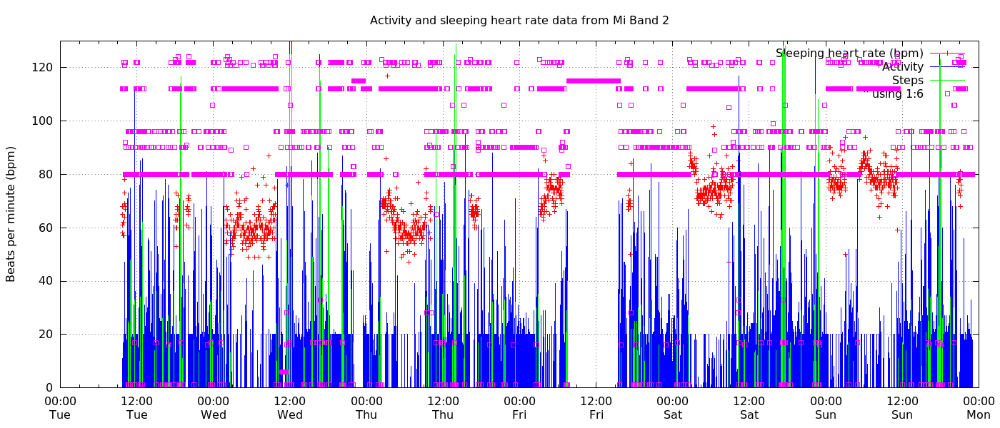

# MiBand2Tools

Scripts and tools related to the Mi Band 2.  Data is extracted from Mi Band 2 using GadgetBridge database export (a SQLite DB). Then plotted using GnuPlot.

This is an example of a rather unrefined plot of the raw data available from a Mi Band 2. Of particular interest to me is the reasting heart-rate which
is measured every 2 minutes while sleeping (if enabled in the settings).

